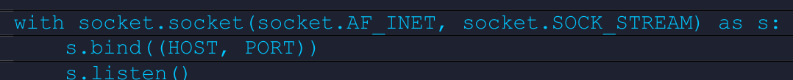
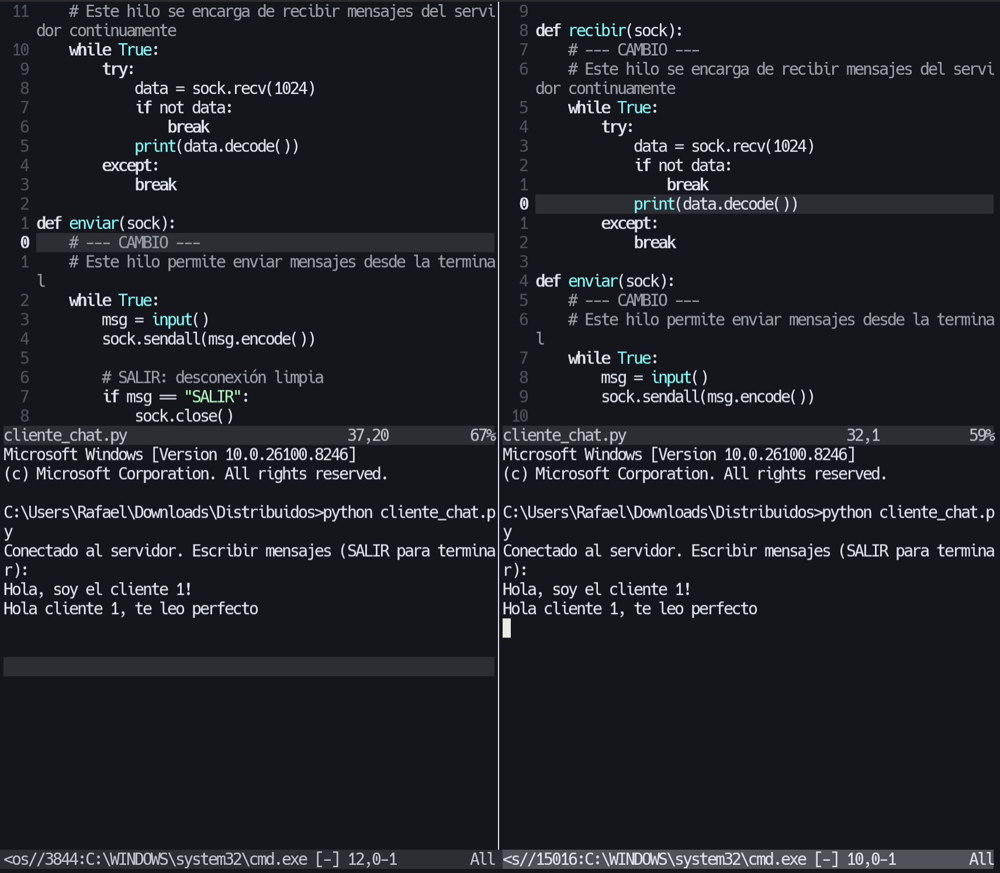
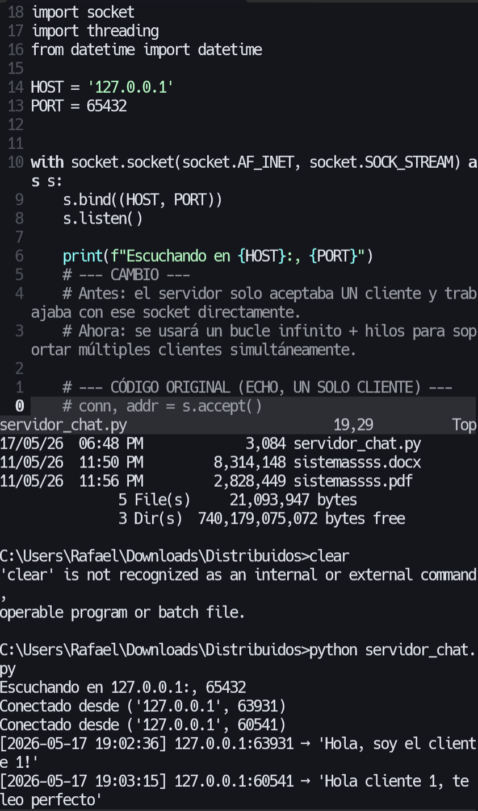
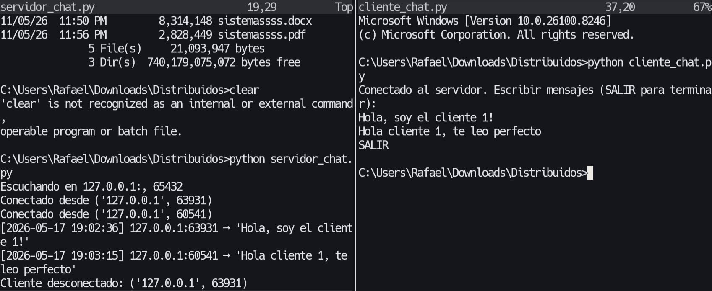
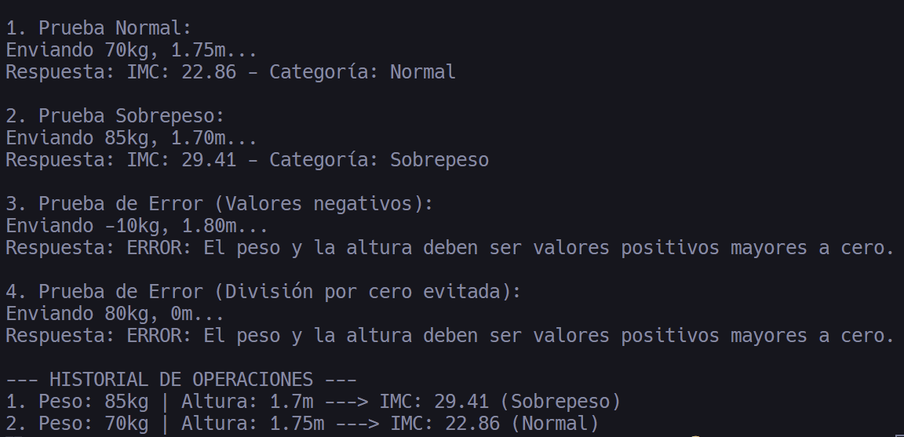
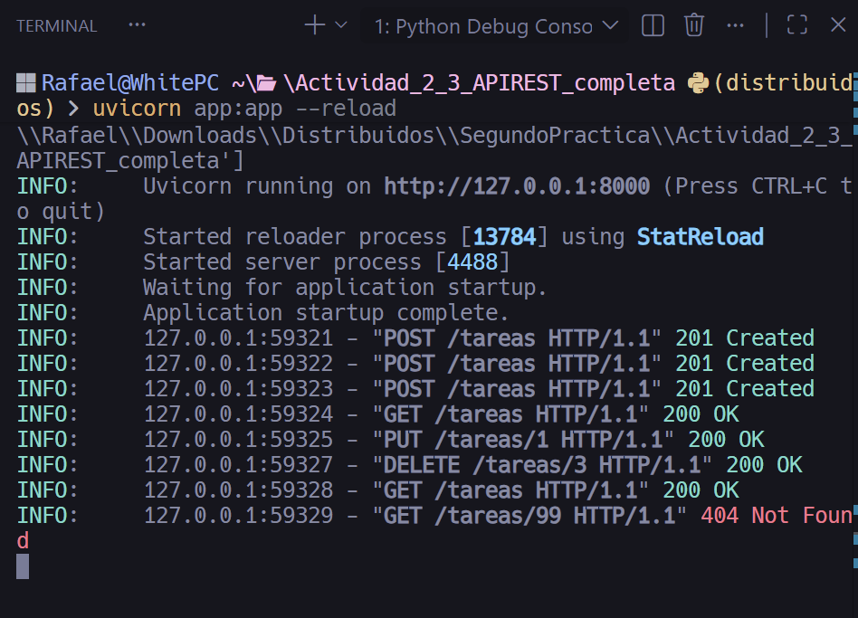
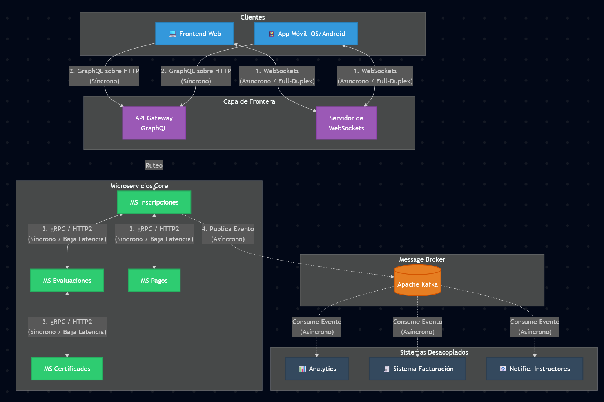

<div align="center">

# Sistemas Distribuidos

**Estudiantes:** Rafael Prieto, Adrián Lazo  
**Docente:** Cristian Fernando Timbi Sisalima  
**Carrera:** Ingeniería en Ciencias de la Computación  
**Nivel:** Sexto Ciclo  
**Fecha:** Mayo de 2026

</div>


## Estructura del proyecto

```text
README.md
parte1/
  captures/
    img1.png
parte2/
  Actividad2_1_Sockets_TCP/
    cliente_chat.py
    servidor_chat.py
    captures/
      image.png
      image1.png
      image2.png
      image3.png
      image4.png
  Actividad2_2_RPC_con_control_de_errores/
    cliente_rpc.py
    servidor_rpc.py
  Actividad2_3_APIREST_completa/
    app.py
    cliente_rest.py
parte3/
  captures/
    image5.png
```

## Parte 1. Análisis Conceptual y Razonamiento

### Pregunta 1.1 - Sincrónico vs. Asincrónico en la práctica

Imagina que eres el arquitecto técnico de una startup de logística. Tienes dos flujos:

Flujo A: Un cliente realiza un pedido y espera confirmación inmediata de disponibilidad en stock (<= 2 segundos).

Flujo B: Una vez confirmado el pedido, se deben notificar al sistema de bodega, al equipo de facturación y al proveedor externo de transporte.

Para cada flujo indica: (i) si usarías comunicación síncrona o asíncrona, (ii) qué mecanismo concreto de los vistos en clase aplicarías, y (iii) justifica por qué ese mecanismo es más adecuado que la alternativa.

Flujo A:

(i) Se usaría la comunicación síncrona, ya que se nos dice que el sistema debe ser rápido. El cliente realiza un pedido y necesita ver si aún queda el producto en stock. Para que esto suceda el sistema de stock debe estar sincronizado y responder inmediatamente.

(ii) Uno de los mecanismos que optaría por aplicar sería REST o gRPC. Si es una aplicación sencilla, REST es suficiente; pero si las peticiones involucran microservicios internos, es recomendable usar gRPC.

(iii) Se considera más adecuado gRPC porque se requiere eficiencia y baja latencia. Aunque su implementación es más compleja, reduce el riesgo de fallos y pérdida de clientes.

Flujo B:

(i) Se usaría comunicación asíncrona, ya que no se requiere una respuesta inmediata. El sistema puede continuar sin esperar la respuesta de bodega, facturación y transporte.

(ii) El mecanismo más eficiente es un Message Broker, que permite enviar un evento único tras la confirmación del pedido.

(iii) Se justifica porque permite desacoplamiento temporal y tolerancia a fallos, lo cual es adecuado para este tipo de arquitectura.

---

### Pregunta 1.2 - Semánticas de Falla en RPC

Un sistema bancario usa RPC para procesar transferencias. El desarrollador implementó semántica at-least-once. El equipo de QA reportó que en pruebas de carga se duplicaron cargos en cuentas de clientes.

### a) Explica por qué at-least-once causó este problema específicamente en este caso y no en otros contextos.
El problema de la semántica at-least-once es que ante fallos de red, el cliente puede reenviar la misma petición varias veces. Esto provoca que la operación se ejecute múltiples veces en el servidor. En el caso de transferencias bancarias, esto genera cargos duplicados porque la operación no es idempotente. Es decir, una misma operación ejecutada más de una vez produce efectos diferentes, lo cual es crítico en este tipo de sistemas.

### b) ¿Qué cambio en la semántica debes aplicar y qué implicaciones técnicas trae ese cambio?
Lo recomendado es usar un sistema como “exactly-once” ya que este ejerce una total seguridad de que el pedido se hace, si la petición ya fue hecha,  esto garantiza que la operación se ejecute una sola vez, incluso si hay reintentos y así se permiten evitar pérdidas, algo fundamental en sistemas de este tipo, donde cualquier pérdida resulta inaceptable.
Las implicaciones que nos puede traer seria el costo de la implementación y la dificultad pero vale la pena gracias a la seguridad que es ofrecida.

---

### Pregunta 1.3 - gRPC vs REST: más allá de las definiciones

Frente a la siguiente afirmación:

"gRPC siempre es mejor que REST porque es más rápido, usa menos ancho de banda y tiene tipado fuerte. Toda empresa debería migrar sus APIs a gRPC de inmediato."

Analiza críticamente esta afirmación. Identifica al menos dos escenarios donde REST sigue siendo la opción correcta, explicando los factores técnicos que guían esa decisión. Usa datos y casos reales vistos en clase.

### Análisis crítico:

REST sigue siendo adecuado en escenarios donde la simplicidad, interoperabilidad y compatibilidad son más importantes que el rendimiento puro.

Escenario 1: APIs públicas e integración con terceros.

REST funciona sobre HTTP/1.1 y es compatible con cualquier lenguaje o plataforma.

Escenario 2: Aplicaciones web.

Frameworks como React, Angular o Vue trabajan naturalmente con REST o GraphQL.

Migrar a gRPC implica mayor complejidad, uso de HTTP/2 y Protocol Buffers, lo cual no siempre es necesario.

---

### Pregunta 1.4 - Detección de errores en código de sockets

El siguiente código Python fue entregado como "servidor TCP". Identifica todos los errores conceptuales y/o de implementación (hay al menos 3) y explica cómo corregirlos:

```python
import socket

HOST = 'localhost'
PORT = 80         # Puerto elegido "al azar"

s = socket.socket(socket.AF_INET, socket.SOCK_DGRAM)  # SOCK_DGRAM
s.connect((HOST, PORT))   # El servidor hace connect()
conn, addr = s.accept()

while True:
		data = conn.recv(4096000)   # Buffer de 4 MB
		conn.sendall(data)
		# No hay condición de cierre
```

Errores identificados y correcciones:

1. Uso de SOCK_DGRAM en lugar de SOCK_STREAM.

2. Uso de connect() en lugar de bind() y listen().
3. Falta de estructura correcta de servidor (no hay bucle de aceptación adecuado).
4. No hay manejo de cierre de conexión.

Corrección:

```python
Codigo corregido:

import socket

HOST = 'localhost'
# un error es que el puerto que se selecciona es un puerto común que es el típico en vez de buscar uno más adecuado
PORT = 65432

s = socket.socket(socket.AF_INET, socket.SOCK_STREAM)  # Aqui tenemos la primera observación ya que antes declaraba SOCK_DGRAM

# Como segundo error tenemos que se usa un comando connect pero se debe usar el comando bind y después un listen
s.bind((HOST, PORT))
s.listen()

# Ahora el servidor debe estar en un bucle para aceptar múltiples conexiones
while True:
    conn, addr = s.accept()

    # Como tercer error es que nos faltaba manejar correctamente la conexión con with
    with conn:
        while True:
            data = conn.recv(4096)  # Buffer más razonable
            if not data:
                break
            conn.sendall(data)
```

## Parte 2. Implementación Práctica (IA guiada y documentada)

### Objetivo

Implementar soluciones funcionales usando mecanismos de comunicación estudiados, aplicando criterio propio sobre el diseño y demostrando apropiación real del código producido.

Puedes usar IA para entender errores o explorar sintaxis. Es obligatorio declarar qué fragmentos vienen de IA y qué modificaste. Si no puedes explicar tu código en la sustentación, la nota es cero.

### Actividad 2.1 - Sockets TCP: Chat bidireccional con registro

1. El servidor soporta al menos 2 clientes simultáneos usando hilos (threading en Python o Thread en Java).
2. Cada mensaje recibido hace broadcast a todos los demás clientes conectados (no solo echo al emisor).
3. El servidor registra en consola: [timestamp] IP:puerto -> 'mensaje'. Ejemplo: [2025-05-10 14:32:01] 127.0.0.1:54321 -> 'Hola a todos'
4. El cliente envía SALIR para desconectarse limpiamente. El servidor maneja esta desconexión sin crash.

#### Capturas requeridas

1. Captura 1: Dos terminales de clientes enviando mensajes simultáneamente.

2. Captura 2: Salida del servidor mostrando el registro con timestamps.

3. Captura 3: Un cliente enviando SALIR y el servidor respondiendo sin errores.


#### Explicación técnica

Para lograr que el servidor soporte múltiples clientes simultáneos, se ha implementado el modelo de "Un hilo por cliente" (Thread-per-client).

En el archivo servidor_chat.py, el hilo principal (Main Thread) ejecuta un bucle infinito while True: donde la única responsabilidad del servidor es llamar a la función bloqueante s.accept(). Cuando un nuevo cliente se conecta, el servidor no procesa sus mensajes en ese mismo hilo; en su lugar, delega el socket recién creado a un nuevo hilo independiente usando threading.Thread(target=manejar_cliente, args=(conn, addr)).start().

La función manejar_cliente se ejecuta en paralelo para cada usuario. Dentro de ella:

- Se leen los mensajes del socket mediante recv().
- Se imprime el log con timestamp usando la librería datetime.
- Se realiza el broadcast recorriendo la lista global clientes y usando sendall() a todos los sockets excepto al emisor.
- Se maneja la desconexión segura comprobando si el mensaje es "SALIR". Si es así, o si ocurre una excepción (como un cierre forzado del lado del cliente), el bloque try-except captura el error, elimina el socket de la lista clientes, y hace un conn.close(), evitando que todo el servidor colapse.

Por el lado de cliente_chat.py, también se usa concurrencia. El cliente levanta un hilo en segundo plano (Daemon Thread) dedicado exclusivamente a recibir datos (sock.recv), mientras el hilo principal se queda bloqueado esperando el ingreso del usuario (input()). Esto es vital para que el cliente pueda leer mensajes entrantes en tiempo real sin tener que presionar Enter primero.

#### Declaración de uso de IA

Qué consulté: Utilicé IA (Gemini) para comprender el funcionamiento detallado del código fuente en Python (sockets y threading) que fue desarrollado colaborativamente con mi compañero, y para redactar la justificación técnica del funcionamiento concurrente.

Qué generó la IA: La IA generó explicaciones paso a paso de cómo los hilos (threading) evitan el bloqueo de la función accept() y recv(), así como sugerencias de cómo ejecutar las pruebas para capturar las evidencias (logs, broadcast y desconexión segura). También estructuró el párrafo de la "Explicación técnica".

Qué modifiqué: Adapté la explicación técnica generada para que se ajuste al formato del informe y validé ejecutando el código localmente que los logs (datetime), el broadcast (iteración de la lista de clientes) y el comando de cierre limpio (SALIR) funcionaran exactamente como la IA y el código describían antes de tomar las capturas.

### Actividad 2.2 - RPC con control de errores

Partiendo del servidor xmlrpc de Python visto en clase, implementa:

1. Función remota calcular_imc(peso_kg, altura_m) que retorne el IMC y su categoría (Bajo peso / Normal / Sobrepeso / Obesidad).
2. Manejo de errores: si el cliente pasa valores negativos o cero, el servidor retorna un mensaje de error descriptivo en lugar de lanzar una excepción sin manejar.
3. Función historial() que retorne los últimos 5 cálculos realizados (persistir en memoria entre llamadas).



#### Declaración de uso de IA

Qué consulté: Utilicé herramientas de IA para comprender cómo mantener la persistencia en memoria (estado) entre múltiples llamadas remotas utilizando la librería xmlrpc.server de Python, y cómo aplicar un manejo de errores suave que envíe strings descriptivos a través del proxy en lugar de lanzar excepciones en crudo.

Qué generó la IA: Un esquema de código donde el estado del historial se guarda en una estructura de datos global (List de Dictionaries) dentro de servidor_rpc.py, limitando su longitud a 5 elementos con pop(). También generó un script de cliente con las 4 pruebas unitarias solicitadas.

Qué modifiqué: Revisé la lógica de la fórmula matemática del IMC para asegurar su exactitud y ejecuté los scripts localmente para validar que la conexión RPC en el puerto 8080 operara correctamente y generara la salida exacta requerida para las evidencias.

### Actividad 2.3 - API REST completa

Implementa una mini-API REST para gestión de tareas (TODO list) con los siguientes endpoints:

| Método HTTP | Endpoint      | Descripción                                      |
|-------------|---------------|--------------------------------------------------|
| GET         | /tareas       | Retorna lista de todas las tareas en JSON       |
| GET         | /tareas/{id}  | Retorna una tarea por ID, o 404 si no existe    |
| POST        | /tareas       | Crea una nueva tarea (body JSON: titulo, descripcion) |
| PUT         | /tareas/{id}  | Actualiza el estado de la tarea a "completada" |
| DELETE      | /tareas/{id}  | Elimina una tarea por ID                        |

Requisitos adicionales: datos en memoria (diccionario/HashMap). Los errores retornan código HTTP apropiado (400, 404) con mensaje JSON explicativo.



#### Declaración de uso de IA

Qué consulté: Utilicé herramientas de IA (Gemini) para entender cómo estructurar un servidor REST en Python siguiendo las recomendaciones vistas en clase (usando FastAPI) y cómo mantener el estado de los datos en memoria mediante diccionarios.

Qué generó la IA: La IA generó la estructura de los cinco endpoints (GET, POST, PUT, DELETE) en api_tareas.py, incluyendo la validación de errores nativa de FastAPI (HTTPException) para retornar códigos 404 y 400 correctamente formateados en JSON. También proveyó un script cliente automatizado (cliente_rest.py) utilizando la librería requests.

Qué modifiqué: Revisé la concordancia de las rutas (endpoints) generadas con las solicitadas en el enunciado de la Actividad 2.3. Ejecuté el código localmente, probando la creación de los modelos con la librería pydantic para el body JSON, y utilicé el script automatizado para extraer las capturas que demuestran el ciclo de vida completo de las tareas y el manejo de excepciones.

## Parte 3. Diseño de Arquitectura (IA como consultor)

### Objetivo

Aplicar criterio técnico para seleccionar el mecanismo de comunicación más adecuado en un escenario real, justificando decisiones y representando la arquitectura mediante un diagrama.

Puedes consultar a la IA para evaluar ideas o explorar alternativas. El diseño final, el diagrama y la justificación deben ser propios y reflejar tu criterio técnico. Documenta las consultas en la Parte 4.

### Escenario: Plataforma de Educación en Línea - "EduConecta"

EduConecta es una plataforma educativa con los siguientes cuatro flujos que debes diseñar:

| # | Funcionalidad | Requerimiento técnico clave |
|---|---------------|-----------------------------|
| A | Chat en vivo durante clases | Latencia < 200ms. Hasta 500 usuarios simultáneos por sala. |
| B | App móvil que consulta el catálogo de cursos | Múltiples clientes (iOS, Android, Web). Datos: cursos, precio, instructor, calificaciones. |
| C | Notificaciones de nuevas inscripciones | Deben llegar al sistema de facturación, al instructor y al módulo de analytics. Desacoplamiento total. |
| D | Comunicación entre microservicios internos (evaluaciones, certificados, pagos) | Alta frecuencia de llamadas internas. Tipado estricto. Múltiples lenguajes (Python + Java). |

### 3.1 - Selección de mecanismos (10 pts)

Para cada funcionalidad (A, B, C, D) indica el mecanismo que seleccionarías y justifica con al menos 2 argumentos técnicos sólidos. Menciona explícitamente por qué descartaste la alternativa más obvia.

#### Funcionalidad A - Chat en vivo

Mecanismo seleccionado: WebSockets.

Argumento técnico 1: WebSockets establece un canal persistente y bidireccional (full-duplex) sobre TCP. Esto permite que el servidor envíe datos proactivamente (Server push) a los 500 clientes sin requerir una nueva petición para cada mensaje, logrando latencias muy bajas.

Argumento técnico 2: El protocolo minimiza el overhead de red; tras el handshake inicial de HTTP, los mensajes viajan como frames binarios de tamaño muy reducido en comparación con las cabeceras HTTP repetitivas.

Descarte explícito: Se descarta REST/HTTP porque es unidireccional y sin estado. Usar REST obligaría a implementar long polling (los 500 clientes preguntando constantemente al servidor), lo cual saturaría la red con nuevas conexiones y haría imposible cumplir la restricción de latencia < 200ms.

#### Funcionalidad B - Catálogo móvil

Mecanismo seleccionado: GraphQL.

Argumento técnico 1: Previene los problemas de over-fetching (traer datos de sobra) y under-fetching (tener que hacer múltiples peticiones). El cliente móvil puede declarar y recibir exactamente los campos necesarios (ej. nombre, precio e instructor) en un solo request.

Argumento técnico 2: Provee un esquema (SDL) fuertemente tipado por defecto, facilitando a los desarrolladores de frontend (iOS, Android, Web) saber exactamente qué datos están disponibles y en qué formato sin depender de documentación externa desactualizada.

Descarte explícito: Se descarta REST tradicional porque obligaría al dispositivo móvil a realizar múltiples solicitudes a diferentes endpoints (ej. /cursos, /instructores, /calificaciones) consumiendo más batería y plan de datos. También se descarta gRPC porque integrarlo nativamente en entornos web o móviles directamente suele ser complejo y requiere proxies adicionales.

#### Funcionalidad C - Notificaciones de inscripción

Mecanismo seleccionado: Message Brokers / MOM (Apache Kafka o RabbitMQ).

Argumento técnico 1: Logra un desacoplamiento temporal y lógico total. El sistema de inscripciones (Productor) lanza el mensaje de "Nueva Inscripción" al intermediario y continúa su ejecución sin esperar. Los sistemas de facturación, instructores y analytics (Consumidores) procesan este evento cuando tienen capacidad.

Argumento técnico 2: Garantiza tolerancia a fallos y resiliencia. Si el sistema de facturación o el de analytics se caen temporalmente, Kafka retiene el mensaje de forma persistente; una vez que los servicios se recuperen, pueden retomar la lectura desde su último offset sin perder inscripciones.

Descarte explícito: Se descartan mecanismos síncronos como REST o gRPC debido a que introducen acoplamiento temporal. Si se usara comunicación síncrona y el servicio de facturación no respondiera, el proceso completo de inscripción del alumno fallaría en cadena o bloquearía el hilo de ejecución.

#### Funcionalidad D - Microservicios internos

Mecanismo seleccionado: gRPC.

Argumento técnico 1: Es altamente eficiente para comunicaciones internas masivas, logrando latencias muy bajas al utilizar serialización binaria comprimida (Protocol Buffers) y multiplexación a través de HTTP/2. Esto resulta hasta 10 veces más compacto y rápido que las cadenas de texto JSON.

Argumento técnico 2: Ofrece interoperabilidad nativa y tipado estricto mediante sus contratos .proto. A partir de este contrato, se genera el código base automáticamente tanto para los servicios programados en Python como para los de Java, evitando errores humanos de integración.

Descarte explícito: Se descarta REST con JSON debido al alto costo de procesamiento y parseo de texto en comunicaciones de alta frecuencia. El overhead de leer JSON y la lentitud del protocolo HTTP/1.1 secuencial lo hacen ineficiente para el tráfico inter-servicios backend comparado con gRPC.

### 3.2 - Diagrama de Arquitectura

Dibuja un diagrama de EduConecta que muestre los 4 mecanismos seleccionados, los componentes que los usan y el flujo de datos. Puedes dibujarlo a mano y fotografiarlo, o usar draw.io / Excalidraw.

El diagrama debe incluir:

- Componentes: Frontend Web, App Móvil, API Gateway, Microservicios (Evaluaciones, Certificados, Pagos), Message Broker, Analytics.
- Flechas etiquetadas con el mecanismo (WebSocket, REST, gRPC, Kafka...).
- Indicación de si cada comunicación es síncrona o asíncrona.

#### Diagrama



#### Descripción del diagrama (decisiones de diseño más importantes ADR)

El diagrama propuesto para EduConecta ilustra una arquitectura híbrida orientada a microservicios (Microservices Architecture) combinada con una arquitectura dirigida por eventos (Event-Driven Architecture). Las decisiones más críticas (ADR) que rigen este diseño son:

1. ADR-01: Separación de la Capa de Frontera (API Gateway vs. WS Server). Se decidió separar el manejo del tráfico síncrono (GraphQL) del tráfico asíncrono persistente (WebSockets). Mantener miles de conexiones TCP abiertas para el chat (Flujo A) consume mucha memoria RAM. Al aislar WebSockets en un servidor dedicado, evitamos que los picos de tráfico en el chat saturen y tumben el API Gateway de GraphQL, garantizando la estabilidad de la navegación en el catálogo (Flujo B).
2. ADR-02: Backend for Frontends (BFF) implícito con GraphQL. Se eligió GraphQL como punto de entrada síncrono para abstraer a las aplicaciones cliente de la complejidad de la red interna. Esto previene que la app móvil tenga que hacer múltiples llamadas a distintos microservicios para armar una vista de curso, reduciendo la carga de la red y el consumo de batería del dispositivo móvil.
3. ADR-03: Backbone Síncrono de Alto Rendimiento (gRPC). Para el tráfico "Este-Oeste" (comunicación interna entre microservicios, Flujo D), se optó por gRPC. Ya que los microservicios están en una red local segura, la baja latencia y la eficiencia de la serialización binaria (Protobuf) justifican su uso sobre REST. Esto es crucial en flujos como Inscripciones -> Pagos, donde la transacción debe ser rápida y fuertemente tipada para evitar errores financieros.
4. ADR-04: Desacoplamiento de procesos no críticos (Kafka). Se implementó el patrón de mensajería Publish/Subscribe (Flujo C). Una vez que se concreta un pago y una inscripción, estas acciones se publican en Apache Kafka. Los sistemas de Facturación y Analytics actúan como consumidores asíncronos. Esto garantiza que la plataforma no se bloquee ni falle si el sistema de envío de emails a los instructores o el proveedor de facturación se encuentran temporalmente caídos, dotando a la plataforma de máxima tolerancia a fallos.

## Parte 4. Reflexión sobre el Uso de IA

### Objetivo

Desarrollar metacognición sobre el uso de herramientas de IA en el aprendizaje de programación distribuida, identificando sus capacidades reales y sus límites.

Sé honesto/a. Los evaluadores valoran la reflexión genuina, no la que describe un uso perfecto de IA. Tiempo sugerido: 20 minutos.

### 4.1 - Registro de Consultas a IA

Completa la siguiente tabla con todas las consultas que realizaste a una IA durante esta práctica:

| # | Pregunta / Consulta realizada | ¿Fue útil la respuesta? | ¿Qué modificaste o ajustaste? | Parte del lab |
|---|------------------------------|------------------------|-------------------------------|---------------|
| 1 | ¿Cómo implementar múltiples clientes con threading en sockets Python? | Sí | Adapté el manejo de la lista de clientes y el broadcast para que funcione correctamente | Actividad 2.1 |
| 2 | ¿Cómo mantener un historial en memoria en un servidor XML-RPC? | Sí | Limité el historial a 5 elementos y validé mejor los datos de entrada | Actividad 2.2 |
| 3 | ¿Cómo manejar errores en FastAPI con códigos HTTP? | Sí | Ajusté los mensajes de error y validé que coincidan con lo pedido (400, 404) | Actividad 2.3 |
| 4 | ¿Qué mecanismo es mejor para comunicación en tiempo real con baja latencia? | Sí | Usé la idea general pero redacté la justificación con mis propias palabras | Parte 3 |
| 5 | ¿Cómo estructurar una explicación técnica clara del uso de threads? | Sí | Reorganicé la explicación y la adapté al formato del informe | Actividad 2.1 |

### 4.2 - Reflexión Crítica Personal (10 pts)

#### Pregunta 4.2.a - ¿En qué parte de la práctica la IA fue más útil y por qué?

La IA fue más útil en la Parte 2, especialmente en la implementación del chat con sockets y el servidor RPC. En estas partes había varios detalles técnicos que no son tan fáciles o evidentes, como el manejo de múltiples clientes con hilos o cómo mantener un estado en memoria entre llamadas remotas. La IA ayudó a aclarar cómo funcionan estas estructuras y a entender mejor la lógica detrás del código, lo que permitió avanzar sin quedarse bloqueado en errores.

#### Pregunta 4.2.b - ¿Hubo algún momento en que la IA te dio una respuesta incorrecta o confusa sobre temas de sistemas distribuidos? Describe qué ocurrió.

Sí, en algunos casos la IA daba respuestas demasiado generales o que no se ajustaban exactamente al contexto del ejercicio, o incluso aluzinaba. Por ejemplo, en la parte de RPC sugería manejar errores lanzando excepciones directamente, cuando el enunciado nos pedía devolver mensajes de error controlados. También en algunos casos proponía soluciones más difíciles de lo necesario, lo que obligó a revisar y simplificar el código para cumplir con los requisitos. Esto mostró que es necesario validar siempre lo que se obtiene.

#### Pregunta 4.2.c - ¿Qué aprendiste en esta práctica que NO habrías podido aprender solo usando IA? ¿Qué le aporta el esfuerzo propio al aprendizaje?

Se aprendió a entender cómo funcionan realmente los mecanismos de comunicación en la práctica, especialmente temas como la concurrencia, el manejo de errores y la diferencia entre comunicación síncrona y asíncrona. Al implementar y probar el código se pudieron observar comportamientos reales que la IA solo describe de forma teórica. El esfuerzo propio permite detectar errores, entender por qué ocurren y cómo solucionarlos, lo que hace que el aprendizaje sea más sólido y aplicable.
